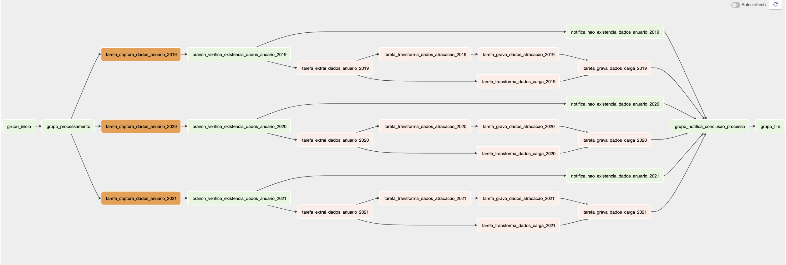

# Guia de Respostas

## a) Olhando para todos os dados disponíveis na fonte citada acima, em qual estrutura de banco de dados você orienta guardá-los no nosso Data Lake? SQL ou NoSQL?

Com base na estrutura dos dados atuais, recomendo armazenar em um banco de dados relacional (SQL), uma vez que o esquema de dados para ambos os arquivos está bem definido e possívelmente não passará por mudanças constantes. Apesar de alguns arquivos possuírem um volume de dados considerável, não vejo um aumento neste volume de forma exponencial. Assim, a princípio não vejo escalabilidade como requisito não-funcional para este cenário, o que justificaria a adoção de um banco NoSQL.

## b) Scripts de extração e transformação

**Item**                                    |**Localização**
|-----                                      |-----
Scripts de Captura                          |dags/tasks/captura_dados_por_ano_tarefa.py
Scripts de Extração                         |dags/tasks/extrai_dados_por_ano_tarefa.py
Scripts de Transformação                    |dags/tasks/transforma_dados_*_por_ano_tarefa.py
Scripts de Criação da Estrutura de Tabelas  |init-database.sql
Diagrama da estrutura das tabelas           |img/der.png
Configuração da Carga                       |dags/tools/const/variabels.py
Lógica para cargas conteinerizadas          |dags/tasks/transforma_dados_carga_por_ano_tarefa.py : Linha 169

**OBS**: _Os scripts de `captura`, `extração`, `transformação` e `gravação` foram feitos diretamente no `Airflow` utilizando o `PySpark`._

### Diagrama da estrutura final de banco de dados

## c) Consulta para geração de planilha em excel

**Item**                                    |**Localização**
|-----                                      |-----
Scripts da Query                            |query-atracacoes.sql
Lógica para coluna bônus                    |query-atracacoes.sql : Linha 102 e 115

## d) Bônus

**Item**                                    |**Localização**
|-----                                      |-----
Arquivo da DAG                              |dags/antaq_etl_dag.py
Criação de tarefas da DAG                   |dags/tasks/processa_dados_grupo.py

### Diagrama da estrutura final da DAG

